# MamaCare — Complete Codebase Analysis & Improvement Blueprint

> **Generated:** December 27, 2025
> **Platform:** Swift 6 / SwiftUI (iOS 17+)
> **Health Score:** 68/100
> **Audit Duration:** Estimated 3-4 weeks to implement all fixes

---

## Executive Summary

MamaCare is a maternal health companion app built with SwiftUI, Firebase Authentication, and SwiftData for local persistence. The app targets pregnant women and new mothers, offering mood tracking, vaccine schedules, nutrition guidance, postpartum support, and emergency contact features.

**Overall Assessment:** The codebase demonstrates a solid foundation with proper separation of concerns between Views, ViewModels, Services, and Models. However, there are several critical issues requiring immediate attention: outdated deprecated APIs (`NavigationLink(isActive:)`), inconsistent state management patterns, large amounts of commented-out code affecting maintainability, and missing modern Swift concurrency adoption.

**Critical Areas:**
- **Architecture:** Mix of `@StateObject` and `@EnvironmentObject` patterns with potential memory leaks
- **UI/UX:** Good design system foundation but missing animations, haptic feedback, and loading states
- **Security:** Password stored in ViewModel memory, Firebase rules need review
- **Performance:** No image caching, large JSON files loaded synchronously

**Top 3 Priorities:**
1. Replace deprecated `NavigationLink(isActive:)` with iOS 16+ navigation patterns
2. Adopt Swift 6 strict concurrency and `@Observable` macro
3. Add comprehensive error handling and loading states

---

## Project Structure Analysis

### Current File Tree
```
Mama-Care/
├── Mama-Care/
│   ├── Mama_CareApp.swift                    # App entry point
│   ├── Models/
│   │   ├── DataModels.swift                  # Core data models (MamaUser, MoodCheckIn, etc.)
│   │   ├── SwiftDataModels.swift             # SwiftData @Model definitions
│   │   ├── NutritionModels.swift             # Food & nutrition models
│   │   ├── PostpartumModels.swift            # Postpartum care tip models
│   │   └── VaccineModels.swift               # Vaccination schedule models
│   ├── ViewModels/
│   │   ├── MamaCareViewModel.swift           # Main app state (1100+ lines)
│   │   └── OnboardingViewModel.swift         # Onboarding flow state
│   ├── Services/
│   │   ├── AuthService.swift                 # Firebase Authentication
│   │   ├── MoodService.swift                 # Firestore mood operations
│   │   ├── UserService.swift                 # User CRUD operations
│   │   ├── SwiftDataService.swift            # Local SwiftData persistence
│   │   ├── NotificationService.swift         # Push notification handling
│   │   ├── EncryptionService.swift           # Data encryption utilities
│   │   ├── DataMigrationService.swift        # Migration helpers
│   │   └── JSONDataLoader.swift              # JSON resource loading
│   ├── Views/
│   │   ├── Auth/
│   │   │   └── AuthLandingView.swift         # Login/Signup landing
│   │   ├── Onboarding/
│   │   │   ├── SplashScreenView.swift        # App launch splash
│   │   │   ├── WelcomeScreenView.swift       # Welcome screen
│   │   │   ├── OnboardingFlowView.swift      # Onboarding coordinator
│   │   │   ├── CreateAccountFlowView.swift   # Account creation flow
│   │   │   ├── CreateAccountStepOneView.swift
│   │   │   ├── CreateAccountStepTwoView.swift
│   │   │   ├── ConsentScreenView.swift       # Privacy consent
│   │   │   ├── UserTypeSelectionView.swift   # Pregnant/HasChild selection
│   │   │   ├── DateCaptureView.swift         # EDD/Birth date
│   │   │   ├── EmergencyContactsView.swift   # Emergency contacts setup
│   │   │   ├── AddEmergencyContactView.swift
│   │   │   └── SignInView.swift              # Login screen
│   │   ├── MainApp/
│   │   │   ├── MainTabView.swift             # Tab bar controller
│   │   │   ├── EnhancedDashboardView.swift   # Home dashboard
│   │   │   ├── MoodCheckInView.swift         # Mood logging
│   │   │   ├── NutritionView.swift           # Food tracker
│   │   │   ├── VaccineScheduleView.swift     # Vaccine tracking
│   │   │   ├── EmergencyView.swift           # Emergency features
│   │   │   ├── EmergencyAlertSentView.swift  # Alert confirmation
│   │   │   ├── EmergencyContactsSection.swift
│   │   │   ├── SettingsView.swift            # App settings
│   │   │   ├── AIChatView.swift              # AI chat interface
│   │   │   ├── PaywallView.swift             # Subscription paywall
│   │   │   ├── PostpartumCareTipView.swift   # Daily tips
│   │   │   ├── SupportiveTipsView.swift      # Mental health support
│   │   │   └── PositiveSupportView.swift     # Encouragement view
│   │   ├── Components/
│   │   │   ├── UIComponents.swift            # Reusable UI elements
│   │   │   ├── PrimaryButtonStyle.swift      # Button styles
│   │   │   ├── MoodTrendChartView.swift      # Charts component
│   │   │   └── EmergencyContactRow.swift     # Contact list item
│   │   └── DesignSystem/
│   │       └── Colors.swift                  # Color definitions
│   └── Resources/
│       ├── nutrition_data.json               # Food database
│       ├── postpartum_motivation.json        # Tips database
│       ├── uk_vaccination_schedule.json      # UK vaccine schedule
│       └── ng_vaccination_schedule.json      # Nigeria vaccine schedule
├── Mama-CareTests/
└── Mama-CareUITests/
```

### Architecture Diagram


### Recommended Structure
```
Mama-Care/
├── App/
│   ├── MamaCareApp.swift
│   └── AppConfiguration.swift
├── Core/
│   ├── Design/
│   │   ├── Colors.swift
│   │   ├── Typography.swift
│   │   ├── Spacing.swift
│   │   └── AnimationTokens.swift
│   ├── Components/
│   │   ├── Buttons/
│   │   ├── Cards/
│   │   ├── Inputs/
│   │   └── Charts/
│   └── Extensions/
├── Features/
│   ├── Auth/
│   │   ├── Views/
│   │   ├── ViewModels/
│   │   └── Services/
│   ├── Onboarding/
│   ├── Dashboard/
│   ├── MoodTracking/
│   ├── Nutrition/
│   ├── Vaccines/
│   ├── Emergency/
│   └── Settings/
├── Services/
│   ├── Network/
│   ├── Storage/
│   └── Analytics/
├── Models/
└── Resources/
```

---

## File-by-File Analysis

### Mama_CareApp.swift
**Path:** `Mama-Care/Mama_CareApp.swift`
**Purpose:** App entry point, Firebase configuration, dependency injection
**Health:** 🟡 Needs Work

**Issues Found:**
| # | Issue | Severity | Line |
|---|-------|----------|------|
| 1 | Firebase configuration in App init may fail silently | 🟡 Medium | ~15 |
| 2 | Missing @MainActor annotation for concurrent safety | 🟡 Medium | - |
| 3 | No error handling for Firebase initialization | 🔴 Critical | - |

**Recommended Fix:**
```swift
import SwiftUI
import FirebaseCore

@main
struct Mama_CareApp: App {
    @StateObject private var viewModel = MamaCareViewModel()

    init() {
        configureFirebase()
    }

    private func configureFirebase() {
        do {
            FirebaseApp.configure()
        } catch {
            assertionFailure("Firebase configuration failed: \(error)")
        }
    }

    var body: some Scene {
        WindowGroup {
            RootView()
                .environmentObject(viewModel)
                .modelContainer(for: [SDMoodCheckIn.self, SDEmergencyContact.self])
        }
    }
}
```

---

### MamaCareViewModel.swift
**Path:** `Mama-Care/ViewModels/MamaCareViewModel.swift`
**Purpose:** Main application state management, authentication flow, data coordination
**Health:** 🔴 Critical Issues

**Issues Found:**
| # | Issue | Severity | Line |
|---|-------|----------|------|
| 1 | Class is 1100+ lines - violates Single Responsibility | 🔴 Critical | - |
| 2 | Uses `@Published` instead of `@Observable` macro | 🟡 Medium | - |
| 3 | Password stored in memory during session | 🔴 Critical | L35 |
| 4 | Missing async/await - uses completion handlers | 🟡 Medium | - |
| 5 | Debug print statements in production code | 🟡 Medium | Multiple |
| 6 | No proper error type - uses String errors | 🟡 Medium | - |

**Recommended Fix (Partial - State Management):**
```swift
import SwiftUI
import Observation

@Observable
@MainActor
final class MamaCareViewModel {
    // MARK: - State
    enum AppState: Equatable {
        case loading
        case splash
        case welcome
        case onboarding
        case authenticated(MamaUser)
        case error(AppError)
    }

    private(set) var state: AppState = .loading
    private(set) var moodCheckIns: [MoodCheckIn] = []
    private(set) var emergencyContacts: [EmergencyContact] = []

    // MARK: - Dependencies
    private let authService: AuthServiceProtocol
    private let moodService: MoodServiceProtocol
    private let userService: UserServiceProtocol

    init(
        authService: AuthServiceProtocol = AuthService(),
        moodService: MoodServiceProtocol = MoodService(),
        userService: UserServiceProtocol = UserService()
    ) {
        self.authService = authService
        self.moodService = moodService
        self.userService = userService
    }

    // MARK: - Actions
    func checkAuthState() async {
        state = .loading
        do {
            if let user = try await authService.getCurrentUser() {
                state = .authenticated(user)
            } else {
                state = .welcome
            }
        } catch {
            state = .error(.authFailed(error.localizedDescription))
        }
    }
}
```

---

### OnboardingViewModel.swift
**Path:** `Mama-Care/ViewModels/OnboardingViewModel.swift`
**Purpose:** Manages onboarding flow state and user data collection
**Health:** 🟡 Needs Work

**Issues Found:**
| # | Issue | Severity | Line |
|---|-------|----------|------|
| 1 | Password and confirmPassword stored in memory | 🔴 Critical | L8-9 |
| 2 | Uses `ObservableObject` instead of `@Observable` | 🟢 Low | - |
| 3 | Validation logic scattered between View and ViewModel | 🟡 Medium | - |
| 4 | No input sanitization for user data | 🟡 Medium | - |

---

### AuthService.swift
**Path:** `Mama-Care/Services/AuthService.swift`
**Purpose:** Firebase Authentication wrapper
**Health:** 🟡 Needs Work

**Issues Found:**
| # | Issue | Severity | Line |
|---|-------|----------|------|
| 1 | Uses completion handlers instead of async/await | 🟡 Medium | - |
| 2 | No protocol abstraction for testing | 🟡 Medium | - |
| 3 | Error messages expose internal details | 🟡 Medium | - |

**Recommended Fix:**
```swift
import FirebaseAuth

protocol AuthServiceProtocol: Sendable {
    func signIn(email: String, password: String) async throws -> AuthUser
    func createUser(email: String, password: String) async throws -> AuthUser
    func signOut() throws
    func getCurrentUser() async throws -> AuthUser?
}

actor AuthService: AuthServiceProtocol {
    enum AuthError: LocalizedError {
        case invalidCredentials
        case userNotFound
        case networkError
        case unknown(String)

        var errorDescription: String? {
            switch self {
            case .invalidCredentials: return "Invalid email or password"
            case .userNotFound: return "Account not found"
            case .networkError: return "Please check your internet connection"
            case .unknown(let msg): return msg
            }
        }
    }

    func signIn(email: String, password: String) async throws -> AuthUser {
        do {
            let result = try await Auth.auth().signIn(withEmail: email, password: password)
            return AuthUser(firebaseUser: result.user)
        } catch let error as NSError {
            throw mapFirebaseError(error)
        }
    }

    private func mapFirebaseError(_ error: NSError) -> AuthError {
        switch error.code {
        case AuthErrorCode.wrongPassword.rawValue,
             AuthErrorCode.invalidEmail.rawValue:
            return .invalidCredentials
        case AuthErrorCode.userNotFound.rawValue:
            return .userNotFound
        case AuthErrorCode.networkError.rawValue:
            return .networkError
        default:
            return .unknown(error.localizedDescription)
        }
    }
}
```

---

### MoodService.swift
**Path:** `Mama-Care/Services/MoodService.swift`
**Purpose:** Firestore operations for mood check-ins
**Health:** 🟢 Good

**Issues Found:**
| # | Issue | Severity | Line |
|---|-------|----------|------|
| 1 | Good async/await adoption | 🟢 Good | - |
| 2 | Missing retry logic for network failures | 🟡 Medium | - |
| 3 | No offline support consideration | 🟡 Medium | - |

---

### Colors.swift
**Path:** `Mama-Care/Views/DesignSystem/Colors.swift`
**Purpose:** App color palette and gradients
**Health:** 🟢 Good

**Current Implementation:**
- Well-organized color extensions
- Gradient definitions
- Consistent naming convention

**Missing Elements:**
- Dark mode support verification needed
- No semantic color naming (e.g., `errorColor`, `successColor`)
- Missing color documentation

---

### AuthLandingView.swift
**Path:** `Mama-Care/Views/Auth/AuthLandingView.swift`
**Purpose:** Login/Signup selection screen
**Health:** 🔴 Critical Issues

**Issues Found:**
| # | Issue | Severity | Line |
|---|-------|----------|------|
| 1 | Duplicate `import SwiftUI` | 🟢 Low | L10-13 |
| 2 | **Deprecated** `NavigationLink(destination:isActive:)` | 🔴 Critical | L53-65 |
| 3 | Missing navigation bar modifier deprecation | 🟡 Medium | L78 |
| 4 | No loading state for navigation | 🟡 Medium | - |

**Recommended Fix:**
```swift
import SwiftUI

struct AuthLandingView: View {
    @EnvironmentObject var viewModel: MamaCareViewModel
    @State private var navigationPath = NavigationPath()

    enum Destination: Hashable {
        case signIn
        case createAccount
    }

    var body: some View {
        NavigationStack(path: $navigationPath) {
            VStack(spacing: 0) {
                Spacer()
                brandingSection
                Spacer()
                actionButtons
                privacyDisclaimer
            }
            .navigationDestination(for: Destination.self) { destination in
                switch destination {
                case .signIn:
                    SignInView()
                case .createAccount:
                    CreateAccountFlowView()
                }
            }
            .toolbar(.hidden, for: .navigationBar)
        }
    }

    private var actionButtons: some View {
        VStack(spacing: 16) {
            Button("Sign In") {
                navigationPath.append(Destination.signIn)
            }
            .buttonStyle(PrimaryButtonStyle())

            Button("Create Account") {
                navigationPath.append(Destination.createAccount)
            }
            .buttonStyle(SecondaryButtonStyle())
        }
        .padding(.horizontal, 20)
    }
}
```

---

### OnboardingFlowView.swift
**Path:** `Mama-Care/Views/Onboarding/OnboardingFlowView.swift`
**Purpose:** Coordinates multi-step onboarding flow
**Health:** 🔴 Critical Issues

**Issues Found:**
| # | Issue | Severity | Line |
|---|-------|----------|------|
| 1 | 500 lines of commented-out code | 🔴 Critical | L1-205, L347-498 |
| 2 | Debug print statements | 🟡 Medium | L286-296 |
| 3 | Step enum not CaseIterable | 🟢 Low | L339-341 |
| 4 | Mixed navigation patterns | 🟡 Medium | - |

**Recommended Fix:**
```swift
import SwiftUI

enum OnboardingStep: Int, CaseIterable {
    case personalInfo
    case accountInfo
    case consent
    case userType
    case dateCapture
    case emergencyContacts

    var progress: Double {
        Double(rawValue + 1) / Double(Self.allCases.count)
    }
}

struct OnboardingFlowView: View {
    @EnvironmentObject var viewModel: MamaCareViewModel
    @StateObject private var onboardingVM = OnboardingViewModel()
    @State private var currentStep: OnboardingStep = .personalInfo

    var body: some View {
        NavigationStack {
            ZStack {
                Color(.systemBackground).ignoresSafeArea()

                VStack(spacing: 0) {
                    ProgressView(value: currentStep.progress)
                        .tint(.mamaCarePrimary)
                        .padding(.horizontal)

                    stepContent
                }
            }
            .toolbar(.hidden, for: .navigationBar)
        }
        .environmentObject(onboardingVM)
    }

    @ViewBuilder
    private var stepContent: some View {
        switch currentStep {
        case .personalInfo:
            CreateAccountStepOneView(
                onboardingVM: onboardingVM,
                onNext: { advance(to: .accountInfo) }
            )
            .transition(.asymmetric(insertion: .move(edge: .trailing), removal: .move(edge: .leading)))

        // ... other cases
        }
    }

    private func advance(to step: OnboardingStep) {
        withAnimation(.spring(response: 0.35, dampingFraction: 0.85)) {
            currentStep = step
        }
    }
}
```

---

### SplashScreenView.swift
**Path:** `Mama-Care/Views/Onboarding/SplashScreenView.swift`
**Purpose:** App launch animation
**Health:** 🟡 Needs Work

**Issues Found:**
| # | Issue | Severity | Line |
|---|-------|----------|------|
| 1 | 100 lines of commented-out code | 🟡 Medium | L91-155 |
| 2 | Fixed 3-second delay is not adaptive | 🟡 Medium | L82 |
| 3 | Animation values could use @State coordination | 🟢 Low | - |

---

### SignInView.swift
**Path:** `Mama-Care/Views/Onboarding/SignInView.swift`
**Purpose:** User authentication login screen
**Health:** 🟡 Needs Work

**Issues Found:**
| # | Issue | Severity | Line |
|---|-------|----------|------|
| 1 | Deprecated `disableAutocorrection` (use `textInputAutocorrection`) | 🟡 Medium | L66 |
| 2 | Alert uses deprecated initializer | 🟡 Medium | L115-117 |
| 3 | Checkbox toggle style duplicated (also in other files) | 🟡 Medium | L154-165 |
| 4 | Missing keyboard handling | 🟡 Medium | - |
| 5 | No biometric authentication option | 🟡 Medium | - |

---

### MainTabView.swift
**Path:** `Mama-Care/Views/MainApp/MainTabView.swift`
**Purpose:** Main tab bar navigation
**Health:** 🟢 Good

**Issues Found:**
| # | Issue | Severity | Line |
|---|-------|----------|------|
| 1 | Standard implementation, well-structured | 🟢 Good | - |
| 2 | Consider adding badge counts | 🟢 Low | - |

---

### EnhancedDashboardView.swift
**Path:** `Mama-Care/Views/MainApp/EnhancedDashboardView.swift`
**Purpose:** Main home screen with health summary
**Health:** 🟡 Needs Work

**Issues Found:**
| # | Issue | Severity | Line |
|---|-------|----------|------|
| 1 | Large view file - could be decomposed | 🟡 Medium | - |
| 2 | Missing pull-to-refresh | 🟡 Medium | - |
| 3 | No skeleton loading states | 🟡 Medium | - |
| 4 | Direct access to viewModel properties | 🟢 Low | - |

---

### MoodCheckInView.swift
**Path:** `Mama-Care/Views/MainApp/MoodCheckInView.swift`
**Purpose:** Mood logging interface
**Health:** 🟡 Needs Work

**Issues Found:**
| # | Issue | Severity | Line |
|---|-------|----------|------|
| 1 | Good emoji-based selection | 🟢 Good | - |
| 2 | Missing haptic feedback on selection | 🟡 Medium | - |
| 3 | No undo capability after submission | 🟢 Low | - |
| 4 | Could benefit from animation on mood select | 🟡 Medium | - |

---

### PaywallView.swift
**Path:** `Mama-Care/Views/MainApp/PaywallView.swift`
**Purpose:** Subscription paywall screen
**Health:** 🔴 Critical Issues

**Issues Found:**
| # | Issue | Severity | Line |
|---|-------|----------|------|
| 1 | No RevenueCat integration | 🔴 Critical | - |
| 2 | Static pricing (not from App Store) | 🔴 Critical | - |
| 3 | Missing restore purchases functionality | 🔴 Critical | - |
| 4 | No loading/processing states | 🟡 Medium | - |

---

### VaccineScheduleView.swift
**Path:** `Mama-Care/Views/MainApp/VaccineScheduleView.swift`
**Purpose:** Vaccine tracking and scheduling
**Health:** 🟢 Good

**Issues Found:**
| # | Issue | Severity | Line |
|---|-------|----------|------|
| 1 | Well-structured with country-specific data | 🟢 Good | - |
| 2 | Good use of JSON data resources | 🟢 Good | - |
| 3 | Consider adding calendar integration | 🟢 Low | - |

---

### SettingsView.swift
**Path:** `Mama-Care/Views/MainApp/SettingsView.swift`
**Purpose:** App settings and profile management
**Health:** 🟢 Good

**Issues Found:**
| # | Issue | Severity | Line |
|---|-------|----------|------|
| 1 | Clean, simplified implementation | 🟢 Good | - |
| 2 | Missing data export option | 🟢 Low | - |
| 3 | No app version display | 🟢 Low | - |

---

## Data Flow Diagrams

### App Initialization Flow

```mermaid
sequenceDiagram
    participant App as MamaCareApp
    participant VM as MamaCareViewModel
    participant Auth as AuthService
    participant Firebase as Firebase
    participant UI as RootView

    App->>Firebase: FirebaseApp.configure()
    App->>VM: Initialize ViewModel
    App->>UI: Render with @EnvironmentObject
    UI->>VM: Check app state
    VM->>Auth: checkAuthState()
    Auth->>Firebase: Auth.auth().currentUser
    Firebase-->>Auth: User or nil
    Auth-->>VM: AuthResult
    alt User Authenticated
        VM->>UI: state = .authenticated
        UI->>UI: Show MainTabView
    else No User
        VM->>UI: state = .splash
        UI->>UI: Show SplashScreen → Welcome
    end
```


### User Authentication Flow


### Mood Check-In Flow


### Onboarding Flow


---

## Component Dependency Graph


---

## Critical Issues (P0 — Fix Immediately)

### Issue 1: Deprecated NavigationLink API
**Files Affected:** `AuthLandingView.swift`, `SignInView.swift`, `CreateAccountFlowView.swift`
**Impact:** App may crash on future iOS versions; already deprecated in iOS 16
**Root Cause:** Using `NavigationLink(destination:isActive:)` instead of `NavigationStack` with `navigationDestination`

**Before:**
```swift
@State private var navigateToSignIn = false

NavigationLink(destination: SignInView(), isActive: $navigateToSignIn) {
    Button("Sign In") {
        navigateToSignIn = true
    }
}
```

**After:**
```swift
@State private var path = NavigationPath()

NavigationStack(path: $path) {
    VStack {
        Button("Sign In") {
            path.append(AuthDestination.signIn)
        }
    }
    .navigationDestination(for: AuthDestination.self) { dest in
        switch dest {
        case .signIn: SignInView()
        case .createAccount: CreateAccountFlowView()
        }
    }
}
```

**Resources:**
- [Apple NavigationStack Documentation](https://developer.apple.com/documentation/swiftui/navigationstack)

---

### Issue 2: Password Stored in ViewModel Memory
**Files Affected:** `OnboardingViewModel.swift`, `MamaCareViewModel.swift`
**Impact:** Security vulnerability - passwords accessible in memory dumps
**Root Cause:** Passwords stored as `@Published` properties

**Before:**
```swift
class OnboardingViewModel: ObservableObject {
    @Published var password: String = ""
    @Published var confirmPassword: String = ""
}
```

**After:**
```swift
@Observable
final class OnboardingViewModel {
    // Never store passwords - pass directly to auth service
    func createAccount(email: String, password: String) async throws {
        try await authService.createUser(email: email, password: password)
        // Password is never stored, only used transiently
    }
}

// In View - use local @State
struct CreateAccountView: View {
    @State private var password = ""
    @State private var confirmPassword = ""

    var body: some View {
        SecureField("Password", text: $password)
        // Password only lives in View's local state
    }
}
```

---

### Issue 3: PaywallView Has No Real Payment Integration
**Files Affected:** `PaywallView.swift`
**Impact:** App Store rejection risk; users cannot actually purchase subscriptions
**Root Cause:** Static UI mockup without RevenueCat/StoreKit integration

**Recommended Fix:** See RevenueCat Integration Blueprint section below.

---

### Issue 4: Massive Commented-Out Code Blocks
**Files Affected:** `OnboardingFlowView.swift`, `ConsentScreenView.swift`, `SplashScreenView.swift`
**Impact:** Maintainability nightmare, confuses developers, increases file size
**Root Cause:** Incremental development without cleanup

**Recommended Fix:** Remove all commented-out code blocks. Use git history if needed.

---

### Issue 5: Firebase Initialization Without Error Handling
**Files Affected:** `Mama_CareApp.swift`
**Impact:** Silent failures could cause app to malfunction
**Root Cause:** No try-catch around Firebase configuration

---

## High Priority Issues (P1 — Fix This Sprint)

### Issue 6: ObservableObject Instead of @Observable
**Files Affected:** All ViewModels
**Impact:** Performance overhead, more boilerplate code
**Root Cause:** Pre-iOS 17 patterns

### Issue 7: Debug Print Statements in Production
**Files Affected:** `OnboardingFlowView.swift`, `ConsentScreenView.swift`, `CreateAccountFlowView.swift`
**Impact:** Log pollution, potential info leakage

### Issue 8: Missing Loading States
**Files Affected:** Most Views
**Impact:** Poor UX during network operations

### Issue 9: No Input Validation/Sanitization
**Files Affected:** Account creation, emergency contacts
**Impact:** Potential for malformed data

### Issue 10: Duplicated Toggle Styles
**Files Affected:** `SignInView.swift`, `UIComponents.swift`, `ConsentScreenView.swift`
**Impact:** Maintenance burden, inconsistency risk

---

## Medium Priority Issues (P2 — Fix Soon)

| # | Issue | Files | Impact |
|---|-------|-------|--------|
| 11 | Missing haptic feedback | All interactive views | Reduced tactile UX |
| 12 | No pull-to-refresh | Dashboard, Mood history | Cannot manually sync |
| 13 | Large ViewModel (1100+ lines) | MamaCareViewModel | Hard to maintain |
| 14 | No skeleton loading states | Dashboard, Lists | Jarring load experience |
| 15 | Missing keyboard dismiss handling | Forms | Keyboard covers inputs |
| 16 | No offline support | All network features | Fails without internet |
| 17 | Hard-coded strings | Multiple views | No localization support |
| 18 | No analytics integration | All features | No usage insights |

---

## UI/UX Excellence Audit

### Design System Assessment

| Element | Status | Issues |
|---------|--------|--------|
| Spacing System | 🟡 Needs Work | Inconsistent padding values (20, 24, 40) |
| Typography Scale | 🟡 Needs Work | Mix of `.system(size:)` and semantic styles |
| Color System | 🟢 Good | Well-defined in Colors.swift |
| Border Radius | 🟡 Needs Work | Multiple values (8, 10, 12, 16, 20, 30) |
| Shadows/Elevation | 🟡 Needs Work | Inconsistent shadow definitions |
| Animation Tokens | 🔴 Missing | No standardized animation durations |

### Recommended Design Tokens

```swift
import SwiftUI

// MARK: - Spacing
enum Spacing {
    static let xxxs: CGFloat = 2
    static let xxs: CGFloat = 4
    static let xs: CGFloat = 8
    static let sm: CGFloat = 12
    static let md: CGFloat = 16
    static let lg: CGFloat = 24
    static let xl: CGFloat = 32
    static let xxl: CGFloat = 48
    static let xxxl: CGFloat = 64
}

// MARK: - Corner Radius
enum CornerRadius {
    static let xs: CGFloat = 4
    static let sm: CGFloat = 8
    static let md: CGFloat = 12
    static let lg: CGFloat = 16
    static let xl: CGFloat = 24
    static let full: CGFloat = 9999
}

// MARK: - Typography
extension Font {
    static let displayLarge = Font.system(size: 34, weight: .bold, design: .rounded)
    static let displayMedium = Font.system(size: 28, weight: .bold, design: .rounded)
    static let headlineLarge = Font.system(size: 22, weight: .semibold)
    static let headlineMedium = Font.system(size: 18, weight: .semibold)
    static let bodyLarge = Font.system(size: 17, weight: .regular)
    static let bodyMedium = Font.system(size: 15, weight: .regular)
    static let caption = Font.system(size: 13, weight: .regular)
    static let captionSmall = Font.system(size: 11, weight: .regular)
}

// MARK: - Animation Tokens
enum AnimationToken {
    static let quick = Animation.spring(response: 0.25, dampingFraction: 0.8)
    static let standard = Animation.spring(response: 0.35, dampingFraction: 0.85)
    static let slow = Animation.spring(response: 0.5, dampingFraction: 0.9)
    static let bouncy = Animation.spring(response: 0.4, dampingFraction: 0.6)
}

// MARK: - Shadows
extension View {
    func cardShadow() -> some View {
        shadow(color: .black.opacity(0.08), radius: 8, x: 0, y: 4)
    }

    func subtleShadow() -> some View {
        shadow(color: .black.opacity(0.05), radius: 4, x: 0, y: 2)
    }

    func elevatedShadow() -> some View {
        shadow(color: .black.opacity(0.12), radius: 16, x: 0, y: 8)
    }
}
```

### Animation Audit

#### Current Animations
| Animation | Location | Quality | FPS | Issues |
|-----------|----------|---------|-----|--------|
| Splash pulse | SplashScreenView | 🟢 Good | 60 | None |
| Loading dots | SplashScreenView | 🟢 Good | 60 | None |
| Button scale | PrimaryButtonStyle | 🟢 Good | 60 | Needs spring physics |

#### Missing Animations
- [ ] Screen transitions (fade, slide)
- [ ] List item staggered entrances
- [ ] Mood selection feedback
- [ ] Success/error state animations
- [ ] Pull-to-refresh custom animation
- [ ] Tab bar selection animation
- [ ] Card press/release feedback
- [ ] Loading skeleton shimmer

#### Award-Winning Animation Examples

**Staggered List Animation:**
```swift
struct StaggeredList<Content: View, Item: Identifiable>: View {
    let items: [Item]
    let content: (Item) -> Content

    var body: some View {
        LazyVStack(spacing: Spacing.md) {
            ForEach(Array(items.enumerated()), id: \.element.id) { index, item in
                content(item)
                    .opacity(appeared ? 1 : 0)
                    .offset(y: appeared ? 0 : 20)
                    .animation(
                        AnimationToken.standard.delay(Double(index) * 0.05),
                        value: appeared
                    )
            }
        }
        .onAppear { appeared = true }
    }

    @State private var appeared = false
}
```

**Mood Selection with Haptics:**
```swift
struct MoodButton: View {
    let mood: MoodType
    let isSelected: Bool
    let action: () -> Void

    var body: some View {
        Button(action: {
            let impact = UIImpactFeedbackGenerator(style: .medium)
            impact.impactOccurred()

            withAnimation(AnimationToken.bouncy) {
                action()
            }
        }) {
            VStack(spacing: Spacing.xs) {
                Text(mood.emoji)
                    .font(.system(size: 48))
                    .scaleEffect(isSelected ? 1.2 : 1.0)

                Text(mood.label)
                    .font(.caption)
                    .foregroundColor(isSelected ? .mamaCarePrimary : .secondary)
            }
            .padding(Spacing.md)
            .background(isSelected ? Color.mamaCarePrimary.opacity(0.1) : Color.clear)
            .clipShape(RoundedRectangle(cornerRadius: CornerRadius.lg))
            .overlay(
                RoundedRectangle(cornerRadius: CornerRadius.lg)
                    .stroke(isSelected ? Color.mamaCarePrimary : Color.clear, lineWidth: 2)
            )
        }
        .buttonStyle(.plain)
    }
}
```

---

## RevenueCat Integration Blueprint

### Current Integration Status
- [ ] SDK Installed & Configured
- [ ] Offerings Fetched
- [ ] Purchase Flow Implemented
- [ ] Restore Purchases
- [ ] Subscription Status Checks
- [ ] Paywall UI
- [ ] Entitlement Gating
- [ ] Analytics Events

### Architecture Diagram


### Complete Implementation

#### 1. Package Installation
Add to Package.swift or SPM:
```swift
.package(url: "https://github.com/RevenueCat/purchases-ios.git", from: "5.0.0")
```

#### 2. Configuration (App Launch)
```swift
import RevenueCat

@main
struct MamaCareApp: App {
    init() {
        Purchases.logLevel = .debug // Remove in production
        Purchases.configure(withAPIKey: "your_api_key")
    }
}
```

#### 3. Subscription Service
```swift
import RevenueCat

@Observable
@MainActor
final class SubscriptionService {
    private(set) var offerings: Offerings?
    private(set) var customerInfo: CustomerInfo?
    private(set) var isPremium = false

    func loadOfferings() async throws {
        offerings = try await Purchases.shared.offerings()
    }

    func purchase(_ package: Package) async throws -> CustomerInfo {
        let result = try await Purchases.shared.purchase(package: package)
        customerInfo = result.customerInfo
        updatePremiumStatus()
        return result.customerInfo
    }

    func restorePurchases() async throws -> CustomerInfo {
        customerInfo = try await Purchases.shared.restorePurchases()
        updatePremiumStatus()
        return customerInfo!
    }

    func checkSubscriptionStatus() async {
        do {
            customerInfo = try await Purchases.shared.customerInfo()
            updatePremiumStatus()
        } catch {
            print("Failed to fetch customer info: \(error)")
        }
    }

    private func updatePremiumStatus() {
        isPremium = customerInfo?.entitlements["premium"]?.isActive == true
    }
}
```

#### 4. Paywall View
```swift
struct PaywallView: View {
    @Environment(\.dismiss) private var dismiss
    @State private var subscriptionService = SubscriptionService()
    @State private var selectedPackage: Package?
    @State private var isPurchasing = false
    @State private var error: Error?

    var body: some View {
        NavigationStack {
            ScrollView {
                VStack(spacing: Spacing.lg) {
                    headerSection
                    featuresSection
                    pricingSection
                    legalSection
                }
                .padding()
            }
            .toolbar {
                ToolbarItem(placement: .topBarTrailing) {
                    Button("Restore") {
                        Task { await restore() }
                    }
                }
                ToolbarItem(placement: .topBarLeading) {
                    Button(action: { dismiss() }) {
                        Image(systemName: "xmark")
                    }
                }
            }
            .task { await loadOfferings() }
            .alert("Error", isPresented: .constant(error != nil)) {
                Button("OK") { error = nil }
            } message: {
                Text(error?.localizedDescription ?? "")
            }
        }
    }

    private var pricingSection: some View {
        VStack(spacing: Spacing.md) {
            if let offerings = subscriptionService.offerings?.current {
                ForEach(offerings.availablePackages, id: \.identifier) { package in
                    PackageButton(
                        package: package,
                        isSelected: selectedPackage?.identifier == package.identifier,
                        action: { selectedPackage = package }
                    )
                }
            }

            Button(action: { Task { await purchase() } }) {
                if isPurchasing {
                    ProgressView()
                        .tint(.white)
                } else {
                    Text("Subscribe Now")
                }
            }
            .buttonStyle(PrimaryButtonStyle())
            .disabled(selectedPackage == nil || isPurchasing)
        }
    }

    private func purchase() async {
        guard let package = selectedPackage else { return }
        isPurchasing = true
        do {
            _ = try await subscriptionService.purchase(package)
            dismiss()
        } catch {
            self.error = error
        }
        isPurchasing = false
    }

    private func restore() async {
        isPurchasing = true
        do {
            _ = try await subscriptionService.restorePurchases()
            dismiss()
        } catch {
            self.error = error
        }
        isPurchasing = false
    }
}
```

---

## Backend Integration: Firebase (Current)

### Current Architecture


### Recommendations for Firebase
1. **Security Rules:** Implement proper Firestore security rules
2. **Offline Support:** Enable Firestore offline persistence
3. **Batch Operations:** Use batched writes for related operations
4. **Indexing:** Create composite indexes for queries

### Example Firestore Rules
```javascript
rules_version = '2';
service cloud.firestore {
  match /databases/{database}/documents {
    // Users can only access their own data
    match /users/{userId} {
      allow read, write: if request.auth != null && request.auth.uid == userId;

      match /moodCheckIns/{checkInId} {
        allow read, write: if request.auth != null && request.auth.uid == userId;
      }

      match /emergencyContacts/{contactId} {
        allow read, write: if request.auth != null && request.auth.uid == userId;
      }
    }
  }
}
```

---

## State Management Architecture

### Current State Flow


### Recommended State Management
```swift
import SwiftUI
import Observation

// MARK: - App State Machine
@Observable
@MainActor
final class AppStateManager {
    enum State: Equatable {
        case loading
        case unauthenticated(UnauthenticatedState)
        case authenticated(AuthenticatedState)
    }

    enum UnauthenticatedState: Equatable {
        case splash
        case welcome
        case signIn
        case onboarding(OnboardingStep)
    }

    struct AuthenticatedState: Equatable {
        let user: MamaUser
        var selectedTab: Tab = .home
    }

    enum Tab {
        case home, mood, nutrition, emergency, settings
    }

    private(set) var state: State = .loading
    private let authService: AuthServiceProtocol

    init(authService: AuthServiceProtocol = AuthService()) {
        self.authService = authService
    }

    func initialize() async {
        do {
            if let user = try await authService.getCurrentUser() {
                state = .authenticated(AuthenticatedState(user: user))
            } else {
                state = .unauthenticated(.splash)
            }
        } catch {
            state = .unauthenticated(.welcome)
        }
    }

    func completeSplash() {
        guard case .unauthenticated(.splash) = state else { return }
        withAnimation {
            state = .unauthenticated(.welcome)
        }
    }

    func signIn(user: MamaUser) {
        withAnimation {
            state = .authenticated(AuthenticatedState(user: user))
        }
    }

    func signOut() {
        withAnimation {
            state = .unauthenticated(.welcome)
        }
    }
}
```

---

## Code Quality Report

### Metrics Summary
| Metric | Current | Target | Status |
|--------|---------|--------|--------|
| Swift Errors | 0 | 0 | 🟢 |
| Deprecated API Usage | 8+ | 0 | 🔴 |
| Commented-Out Code (lines) | 600+ | 0 | 🔴 |
| Force Unwraps | ~15 | 0 | 🟡 |
| Duplicate Code | ~10% | <5% | 🟡 |
| ViewModel Size (max lines) | 1100 | <300 | 🔴 |
| Test Coverage | 0% | >70% | 🔴 |

### Technical Debt Inventory
| ID | Description | Effort | Impact | Priority |
|----|-------------|--------|--------|----------|
| TD-1 | Migrate to @Observable macro | L | High | P1 |
| TD-2 | Remove all commented-out code | S | High | P0 |
| TD-3 | Split MamaCareViewModel | L | High | P1 |
| TD-4 | Replace deprecated NavigationLink | M | High | P0 |
| TD-5 | Add comprehensive error handling | M | High | P1 |
| TD-6 | Implement unit tests | L | High | P1 |
| TD-7 | Add RevenueCat integration | M | High | P0 |
| TD-8 | Implement offline support | M | Medium | P2 |
| TD-9 | Add localization support | M | Medium | P2 |
| TD-10 | Implement analytics | S | Medium | P2 |

---

## Platform-Specific Checklist (iOS)

### Required for iOS 17+
- [x] SwiftUI-first architecture
- [x] Firebase integration
- [x] SwiftData for local storage
- [ ] @Observable macro (currently using @ObservableObject)
- [ ] NavigationStack with typed destinations
- [x] Charts framework integration
- [ ] Haptic feedback (UIImpactFeedbackGenerator)
- [x] Dynamic Type support (mostly)
- [x] Dark mode support (colors defined)
- [x] Safe area handling

### App Store Requirements
- [ ] App icon (all sizes) - needs verification
- [ ] Launch screen configured
- [ ] Privacy policy URL
- [ ] Terms of service URL
- [ ] App Store screenshots
- [ ] In-app purchases configured (RevenueCat needed)
- [ ] Privacy manifest (PrivacyInfo.xcprivacy)

---

## Implementation Roadmap

### Phase 1: Critical Fixes (Week 1)
| Task | Files | Effort |
|------|-------|--------|
| Remove all commented-out code | Multiple | 2h |
| Fix deprecated NavigationLink APIs | Auth, Onboarding | 4h |
| Add Firebase init error handling | Mama_CareApp.swift | 1h |
| Remove password from ViewModel storage | ViewModels | 2h |
| Remove debug print statements | Multiple | 1h |

### Phase 2: Architecture Improvements (Week 2)
| Task | Files | Effort |
|------|-------|--------|
| Migrate to @Observable macro | All ViewModels | 8h |
| Split MamaCareViewModel | ViewModels | 6h |
| Create protocol abstractions for Services | Services | 4h |
| Implement proper error types | Models, Services | 4h |

### Phase 3: UI/UX Elevation (Week 3)
| Task | Files | Effort |
|------|-------|--------|
| Add haptic feedback | All interactive views | 4h |
| Implement loading states | All network views | 6h |
| Add skeleton loaders | Dashboard, Lists | 4h |
| Implement staggered animations | List views | 4h |
| Add pull-to-refresh | Dashboard, History | 2h |

### Phase 4: Integration & Polish (Week 4)
| Task | Files | Effort |
|------|-------|--------|
| RevenueCat integration | PaywallView, new files | 8h |
| Add analytics (optional) | Throughout | 4h |
| Implement unit tests | Tests folder | 8h |
| Performance optimization | Throughout | 4h |

---

## Production Readiness Checklist

### Technical Requirements
- [ ] No crashes on launch
- [ ] All deprecated APIs replaced
- [ ] Error states for all failures
- [ ] Loading states everywhere
- [ ] Empty states designed
- [ ] Offline handling
- [ ] Memory leaks checked
- [ ] Analytics tracking
- [ ] Crash reporting (Crashlytics)

### Performance Requirements
- [ ] App launch < 2 seconds
- [ ] Animations at 60fps
- [ ] No jank during scroll
- [ ] Images optimized
- [ ] Bundle size < 50MB

### Security Requirements
- [ ] Passwords never stored in memory
- [ ] Secure Firebase rules deployed
- [ ] No sensitive data in logs
- [ ] Encryption for local storage

---

## Resources & References

### Official Documentation
- [Apple Human Interface Guidelines](https://developer.apple.com/design/human-interface-guidelines/)
- [SwiftUI Documentation](https://developer.apple.com/documentation/swiftui/)
- [Swift Concurrency](https://developer.apple.com/documentation/swift/concurrency)
- [RevenueCat iOS SDK](https://www.revenuecat.com/docs/ios)
- [Firebase iOS Documentation](https://firebase.google.com/docs/ios/setup)

### Design Resources
- [SF Symbols 6](https://developer.apple.com/sf-symbols/)
- [Apple Design Resources](https://developer.apple.com/design/resources/)

### Swift Best Practices
- [Swift Style Guide](https://google.github.io/swift/)
- [Swift Concurrency Roadmap](https://forums.swift.org/t/swift-concurrency-roadmap/41611)

---

*This audit was generated on December 27, 2025. For questions or clarifications, please refer to the codebase directly or consult the development team.*
